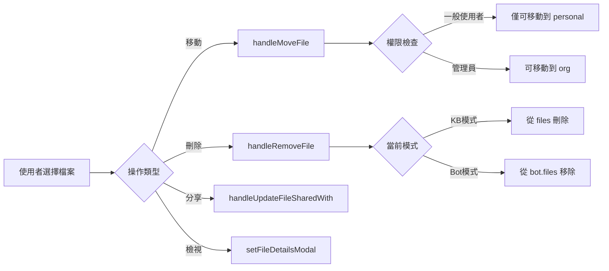
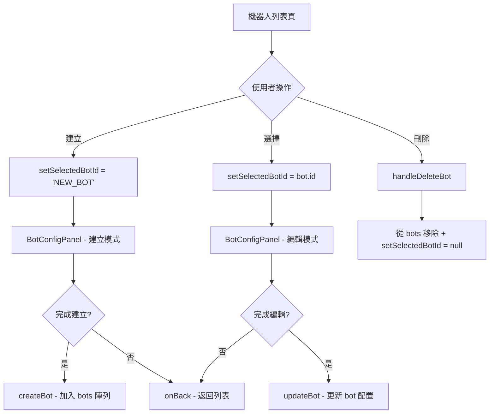
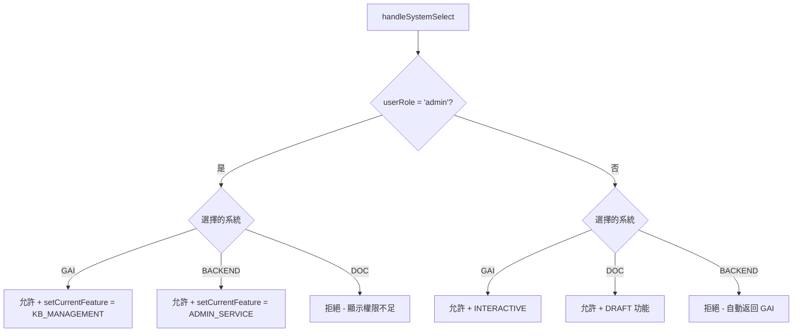

# N946 前端展示專案 - 完整技術文件

## 📌 專案概述

**N946 Frontend Demo** 是一個功能完整的 GAI（Generative AI）應用平台前端展示專案，整合了多個 AI 互動功能，包含知識庫管理、智能問答、答詢機器人、PPT 生成、提示詞優化、文件翻譯以及完整的管理後台系統。

### 技術棧

| 技術 | 版本 | 用途 |
|------|------|------|
| **React** | 18.2.0 | 前端框架 |
| **Vite** | 5.0.8 | 建置工具與開發伺服器 |
| **TailwindCSS** | 3.4.0 | CSS 框架 |
| **Lucide React** | 0.300.0 | 圖標庫 |
| **clsx** / **tailwind-merge** | - | 樣式合併工具 |

### 部署資訊

- **Repository**: `tv6747/n946_frontend_demo`
- **Homepage**: [https://tv6747.github.io/n946_frontend_demo/](https://tv6747.github.io/n946_frontend_demo/)
- **部署方式**: GitHub Pages (`npm run deploy`)

---

## 🏗️ 專案架構

```
frontend_demo/
├── src/
│   ├── App.jsx                    # 主應用程式 (狀態管理與路由邏輯)
│   ├── main.jsx                   # 應用入口
│   ├── index.css                  # 全域樣式
│   ├── assets/                    # 靜態資源 (圖片、Logo)
│   ├── components/                # 共用元件
│   │   ├── common/                # 通用元件 (6 個)
│   │   │   ├── ChatInput.jsx
│   │   │   ├── ChatMessage.jsx
│   │   │   ├── MainDropdown.jsx
│   │   │   ├── MenuItem.jsx
│   │   │   ├── ModalOverlay.jsx
│   │   │   └── TreeNode.jsx
│   │   ├── layout/                # 佈局元件
│   │   │   └── MainLayout.jsx
│   │   └── modals/                # 彈窗元件 (7 個)
│   │       ├── ShareModal.jsx
│   │       ├── UploadModal.jsx
│   │       ├── ExportModal.jsx
│   │       ├── SaveArchiveModal.jsx
│   │       ├── LLMSettingsModal.jsx
│   │       ├── FileDetailsModal.jsx
│   │       └── AddTermModal.jsx
│   ├── features/                  # 功能模組 (34 個元件)
│   │   ├── admin/                 # 管理後台 (16 個元件)
│   │   │   ├── ServiceManagement.jsx
│   │   │   ├── AuditManagement.jsx
│   │   │   ├── UnifiedBackendSidebar.jsx
│   │   │   ├── BotManagementPanel.jsx
│   │   │   ├── ModelManagementPanel.jsx
│   │   │   ├── ModelParametersPanel.jsx
│   │   │   ├── PromptManagementPanel.jsx
│   │   │   ├── APIManagementPanel.jsx
│   │   │   └── ... (共 16 個)
│   │   ├── bot/                   # 機器人配置
│   │   │   └── BotConfigPanel.jsx
│   │   ├── chat/                  # 對話功能 (3 個)
│   │   │   ├── ChatInterface.jsx
│   │   │   ├── CommonHistorySidebar.jsx
│   │   │   └── WelcomeScreen.jsx
│   │   ├── corpus/                # 語料庫管理 (7 個)
│   │   │   ├── CorpusFeature.jsx
│   │   │   ├── CorpusSidebar.jsx
│   │   │   ├── ProperNounPanel.jsx
│   │   │   ├── SynonymPanel.jsx
│   │   │   ├── ImportConflictManager.jsx
│   │   │   ├── SynonymManager.jsx
│   │   │   └── TermDefinitionManager.jsx
│   │   ├── kb/                    # 知識庫管理 (2 個)
│   │   │   ├── KBSidebar.jsx
│   │   │   └── KBManagerPanel.jsx
│   │   ├── ppt/                   # PPT 生成 (2 個)
│   │   │   ├── PPTGenerationInterface.jsx
│   │   │   └── CanvasPreview.jsx
│   │   ├── prompt/                # 提示詞優化 (2 個)
│   │   │   ├── PromptOptimizerInterface.jsx
│   │   │   └── PromptSaveConfirmModal.jsx
│   │   └── translation/           # 文件翻譯
│   │       └── DocumentTranslationInterface.jsx
│   ├── data/                      # 資料與常數
│   │   ├── constants.js           # 系統常數定義
│   │   ├── mockData.js            # 模擬資料 (知識庫、使用者、機器人)
│   │   ├── mockLLMData.js         # LLM 模擬資料
│   │   └── mockServiceData.js     # 服務模擬資料
│   ├── utils/                     # 工具函數
│   │   └── helpers.js             # 樹狀節點查找工具
│   └── hooks/                     # 自定義 Hooks
├── index.html                     # HTML 入口
├── package.json                   # 專案配置
├── vite.config.js                 # Vite 配置
├── tailwind.config.js             # Tailwind 配置
└── README.md                      # 專案說明
```

---

## 🎯 系統核心架構

### 三大平台系統

應用程式支援三個主要系統的切換，並根據使用者角色顯示不同功能：

#### 1. **GAI 互動平台** (`currentSystem = 'GAI'`)
- **對象**: 一般使用者 + 管理員
- **核心功能**:
  - 互動問答 (`INTERACTIVE`)
  - 知識庫管理 (`KB_MANAGEMENT`)
  - PPT 互動產出 (`PPT_GEN`)
  - 提示詞優化 (`PROMPT_OPT`)
  - 文件翻譯 (`DOC_TRANS`)
  - 答詢機器人 (預設機器人: 客服小幫手、數據分析師)

#### 2. **智慧公文輔助系統** (`currentSystem = 'DOC'`)
- **對象**: 僅一般使用者 (管理員無權存取)
- **專用功能** (所有以 `DRAFT_` 開頭):
  - 例行函稿 - 署長信箱 (`DRAFT_MAIL`)
  - 例行函稿 - 山坡地社區監測 (`DRAFT_HILL`)
  - 例行函稿 - 禁建限區 (`DRAFT_AREA`)
  - 例行函稿 - 室內裝修 (`DRAFT_DECOR`)
  - 公文檔案上傳生成案件歷程 (`DRAFT_DOC_GEN`)

#### 3. **後台管理系統** (`currentSystem = 'BACKEND'`)
- **對象**: 僅管理員
- **管理功能**:
  - **服務管理** (`ADMIN_SERVICE`):
    - 應用管理 (`apps`)
    - 知識庫權限 (`kb_permission`)
    - 答詢機器人管理 (`bot_management`)
  - **語料庫管理**:
    - 專有名詞語料庫 (`ADMIN_PROPER_NOUN`)
    - 近似詞語料庫 (`ADMIN_SYNONYM`)
  - **語言模型管理** (`ADMIN_LLM`):
    - 模型管理 (`models`)
    - 模型參數管理 (`params`)
  - **其他管理**:
    - 提示詞管理 (`ADMIN_PROMPTS`)
    - API 管理 (`ADMIN_APIS`)
    - 稽核管理 (`ADMIN_AUDIT`): 知識庫紀錄、對話紀錄、統計圖表

---

## 🔑 核心狀態管理

[`App.jsx`](file:///c:/Users/6747/Desktop/Projekt/2026/N946/frontend_demo/src/App.jsx) 是整個應用的狀態中心，採用 React Hooks 管理狀態：

### 主要狀態

| 狀態變數 | 類型 | 說明 |
|---------|------|------|
| `currentFeature` | Object | 當前選定的功能 (從 `FEATURES` 中選擇) |
| `currentSystem` | String | 當前系統 (`'GAI'` / `'DOC'` / `'BACKEND'`) |
| `userRole` | String | 使用者角色 (`'admin'` / `'user'`) |
| `selectedFolderId` | String | 當前選定的資料夾 ID |
| `files` | Array | 全部檔案資料 (來自 `MASTER_FILES`) |
| `kbTreeData` | Array | 知識庫樹狀結構資料 |
| `bots` | Array | 答詢機器人列表 |
| `selectedBotId` | String/null | 當前選定的機器人 ID |
| `kbMode` | String | 知識庫模式 (`'qa'` / `'manage'`) |
| `kbSelectedFileIds` | Array | RAG 問答選定的檔案 ID 列表 |
| `isSidebarOpen` | Boolean | 側邊欄開關狀態 |

### 管理後台專用狀態

| 狀態變數 | 說明 |
|---------|------|
| `adminAppSystem` | 應用系統篩選 (預設 `'ALL'`) |
| `adminAuditView` | 稽核檢視類型 (`'kb_logs'` / `'chat_records'` / `'stats'`) |
| `serviceSubModule` | 服務管理子模組 (`'apps'` / `'kb_permission'` / `'bot_management'`) |
| `llmSubModule` | LLM 管理子模組 (`'models'` / `'params'`) |
| `selectedCorpusId` | 當前語料庫 ID (`'proper_noun'` / `'synonym'`) |

### Modal 狀態

```javascript
isShareModalOpen         // 分享彈窗
isUploadModalOpen        // 上傳彈窗
isExportModalOpen        // 匯出彈窗
isSaveModalOpen          // 儲存歸檔彈窗
isPromptSaveModalOpen    // 提示詞儲存確認彈窗
isLLMModalOpen           // LLM 設定彈窗
isAddTermModalOpen       // 新增術語彈窗
fileDetailsModal         // 檔案詳情彈窗 (存放檔案物件或 null)
```

---

## 📊 資料常數定義

所有系統常數定義於 [`constants.js`](file:///c:/Users/6747/Desktop/Projekt/2026/N946/frontend_demo/src/data/constants.js)：

### 1. 模式定義 (`MODES`)

```javascript
export const MODES = {
  CHAT: 'chat',                              // 一般對話
  KB: 'knowledge',                            // 知識庫
  PROMPT: 'prompt_opt',                       // 提示詞優化
  TRANS: 'translation',                       // 翻譯
  PPT: 'ppt_generation',                      // PPT 生成
  BOT_MGR: 'bot_management',                  // 機器人管理
  CORPUS_MGR: 'corpus_management',            // 語料庫管理
  ADMIN_SERVICE: 'admin_service_management',  // 服務管理
  ADMIN_PROPER_NOUN: 'admin_proper_noun',     // 專有名詞管理
  ADMIN_SYNONYM: 'admin_synonym',             // 近似詞管理
  ADMIN_MODELS: 'admin_models',               // 模型管理
  ADMIN_PARAMS: 'admin_params',               // 參數管理
  ADMIN_PROMPTS: 'admin_prompts',             // 提示詞管理
  ADMIN_APIS: 'admin_apis',                   // API 管理
  ADMIN_LLM: 'admin_llm_management',          // LLM 管理
  ADMIN_AUDIT: 'admin_audit_management'       // 稽核管理
};
```

### 2. 功能特性 (`FEATURES`)

每個 Feature 包含:
- `id`: 唯一識別碼
- `label`: 顯示名稱
- `mode`: 對應的 MODES
- `placeholder`: 輸入框提示文字
- 可選: `allowUpload`, `hideLLMSettings`

範例:
```javascript
INTERACTIVE: { 
  id: 'interactive', 
  label: '互動問答', 
  mode: MODES.CHAT, 
  placeholder: '輸入您的問題...' 
}

KB_MANAGEMENT: { 
  id: 'kb_manage', 
  label: '知識庫', 
  mode: MODES.KB, 
  placeholder: '' 
}

DRAFT_DOC_GEN: { 
  id: 'draft_doc_gen', 
  label: '公文檔案上傳生成案件歷程', 
  mode: MODES.CHAT, 
  placeholder: '請上傳公文檔案...', 
  allowUpload: true, 
  hideLLMSettings: true 
}
```

### 3. LLM 配置

- **語言列表** (`LANGUAGES`): 自動偵測、正體中文、簡體中文、日語、韓語、英語、法語、德語、西班牙語
- **系統提示預設** (`SYSTEM_PROMPTS`): 通用助手、親切客服、專業嚴謹、創意發想、程式專家
- **模型列表** (`LLM_MODELS`): GPT-4o, Claude 3.5 Sonnet, Gemini 1.5 Pro, Llama 3 70B
- **提示詞範本** (`PROMPT_TEMPLATES`): 通用預設、台灣公文正式語氣、重點摘要專家、創意文案寫手、資深程式架構師

### 4. 歡迎訊息配置 (`WELCOME_CONFIG`)

各功能的歡迎畫面文案與建議問題，例如：

```javascript
kb_qa: { 
  title: '知識庫智能問答',
  sub: '我將基於您選定的文件內容進行回答，請盡量具體提問。',
  suggestions: [
    '總結選定文件的重點', 
    '文件中提到的主要數據有哪些？', 
    '比較這幾份文件的異同之處'
  ]
}
```

### 5. PPT 範本 (`PPT_TEMPLATES`)

6 種預設 PPT 配色方案：
- 企業商務藍 (`bg-blue-600`)
- 極簡現代灰 (`bg-slate-700`)
- 創意活潑橘 (`bg-orange-500`)
- 學術研究綠 (`bg-emerald-600`)
- 科技未來紫 (`bg-indigo-600`)
- 高雅質感黑 (`bg-zinc-800`)

---

## 🛠️ 核心功能模組解析

### 1. 知識庫管理 (`KB_MANAGEMENT`)

**雙模式設計**：

#### 模式 A: QA 問答模式 (`kbMode = 'qa'`)
- **UI**: 顯示 `ChatInterface`
- **側邊欄**: 顯示 `CommonHistorySidebar` (歷史對話紀錄)
- **RAG 上下文**: 透過 `kbSelectedFileIds` 選定的檔案作為 RAG 上下文
- **互動**: 使用者可基於選定文件進行智能問答

#### 模式 B: 管理模式 (`kbMode = 'manage'`)
- **UI**: 顯示 `KBManagerPanel`
- **側邊欄**: 顯示 `KBSidebar` (資料夾樹狀結構與檔案選擇)
- **功能**:
  - 檔案上傳 (`onUpload`)
  - 檔案移動 (`onMoveFile`)
  - 檔案刪除 (`onRemove`)
  - 檔案分享 (`onShare`)
  - 檢視檔案詳情 (`onViewDetails`)
  - 開始 QA 模式 (`onStartChat`)

**權限控制**:
- 一般使用者可存取 `personal` 和 `shared_*` 資料夾
- 管理員僅能存取 `org` 組織資料夾
- 移動檔案時，一般使用者僅能移動到個人資料夾

---

### 2. 答詢機器人管理 (`BOT_MANAGEMENT`)

**雙視圖設計**：

#### 視圖 A: 機器人列表 (`selectedBotId = null`)
- **元件**: `BotManagementPanel`
- **功能**:
  - 顯示所有機器人列表
  - 建立新機器人 (`onCreate` → `selectedBotId = 'NEW_BOT'`)
  - 選擇機器人進行編輯 (`onSelectBot`)
  - 刪除機器人 (`onDeleteBot`)
  - 更新機器人狀態 (`onUpdateBot`)

#### 視圖 B: 機器人配置 (`selectedBotId !== null`)
- **元件**: `BotConfigPanel`
- **配置項目**:
  - 機器人名稱
  - 歡迎訊息
  - 關聯檔案 (`files`)
  - 可存取使用者 (`accessibleUsers`)
- **Mode**:
  - 建立模式: `isCreating = true` (當 `selectedBotId = 'NEW_BOT'`)
  - 編輯模式: `isCreating = false`
- **功能**:
  - 移除關聯檔案
  - 從資料夾新增檔案 (`folderFiles` 來自 `filesInCheckedFolders`)
  - 開啟 LLM 設定
  - 刪除機器人
  - 返回列表 (`onBack`)

**資料夾多選功能** (`botMgrCheckedFolderIds`):
- 使用者可勾選多個資料夾
- 所有勾選資料夾內的檔案會顯示在左側面板 (`filesInCheckedFolders`)
- 可將檔案新增到機器人的關聯檔案中

---

### 3. 對話互動 (`ChatInterface`)

**通用對話元件**，用於多種功能：
- 互動問答 (`INTERACTIVE`)
- 知識庫 QA 模式 (`kb_qa`)
- 答詢機器人對話 (`BOT_CS`, `BOT_DATA`)
- 公文擬稿 (所有 `DRAFT_*` 功能)

**特性**:
- 支援 RAG 上下文 (`ragContext`)
- 可匯出對話 (`onExport`)
- 可儲存對話 (`onSave`)
- LLM 設定 (`onOpenLLMSettings`)
- 側邊欄顯示歷史對話 (`CommonHistorySidebar`)

---

### 4. 語料庫管理 (`CORPUS_MANAGEMENT`)

**管理工具**:
- `ProperNounPanel`: 專有名詞與定義管理
- `SynonymPanel`: 近似詞與標準詞對應管理
- `CorpusFeature`: 語料庫主框架
- `ImportConflictManager`: 匯入衝突處理
- `SynonymManager`: 同義詞管理
- `TermDefinitionManager`: 術語定義管理

**切換邏輯**:
```javascript
selectedCorpusId: 'proper_noun' | 'synonym'
```

---

### 5. 管理後台 (`BACKEND` System)

**服務管理** (`ADMIN_SERVICE`):
- 應用管理 (`apps`): `ApplicationManagementPanel`
- 知識庫權限 (`kb_permission`): `KBPermissionPanel`
- 答詢機器人管理 (`bot_management`): `BotManagementPanel` + `BotConfigPanel`

**語言模型管理** (`ADMIN_LLM`):
- 模型管理 (`models`): `ModelManagementPanel`
- 模型參數管理 (`params`): `ModelParametersPanel`

**其他管理模組**:
- 專有名詞語料庫 (`ADMIN_PROPER_NOUN`): `ProperNounPanel`
- 近似詞語料庫 (`ADMIN_SYNONYM`): `SynonymPanel`
- 提示詞管理 (`ADMIN_PROMPTS`): `PromptManagementPanel`
- API 管理 (`ADMIN_APIS`): `APIManagementPanel`
- 稽核管理 (`ADMIN_AUDIT`): `AuditManagement`
  - 子檢視: `kb_logs`, `chat_records`, `stats`

**側邊欄**: `UnifiedBackendSidebar` (整合所有管理功能的導航)

---

### 6. 其他功能模組

- **PPT 生成** (`PPT_GEN`): `PPTGenerationInterface` + `CanvasPreview`
- **提示詞優化** (`PROMPT_OPT`): `PromptOptimizerInterface` + `PromptSaveConfirmModal`
- **文件翻譯** (`DOC_TRANS`): `DocumentTranslationInterface`

---

## 🔄 核心資料流與操作邏輯

### 檔案操作流程



### 機器人管理流程



### 系統切換與權限控制



---

## 🧩 工具函數

定義於 [`helpers.js`](file:///c:/Users/6747/Desktop/Projekt/2026/N946/frontend_demo/src/utils/helpers.js):

### `findNodeById(nodes, id)`
遞迴搜尋樹狀結構中的節點。

**使用場景**: 在 `KB_TREE_DATA` 中根據 ID 查找資料夾節點。

```javascript
const folder = findNodeById(KB_TREE_DATA, 'personal');
// 回傳: { id: 'personal', label: '個人資料夾', children: [...] }
```

### `findNodePath(nodes, targetId, currentPath = [])`
取得節點的完整路徑（標籤陣列）。

**使用場景**: 顯示資料夾的麵包屑導航。

```javascript
const path = findNodePath(KB_TREE_DATA, 'personal_docs_2024');
// 回傳: ['個人資料夾', '文件', '2024']
```

### `getAllFileIds(node, allFiles)`
遞迴取得節點及其所有子節點中的檔案 ID。

**使用場景**: 選擇資料夾時，自動選取其下所有檔案。

```javascript
const fileIds = getAllFileIds(folderNode, files);
// 回傳: ['file_1', 'file_2', 'file_3', ...]
```

---

## 🎨 UI 佈局結構

### 主佈局元件 (`MainLayout`)

```jsx
<MainLayout 
  sidebar={renderSidebar()} 
  header={renderHeader()} 
  modals={...}
>
  {/* 主內容區 - 根據 currentFeature.mode 動態渲染 */}
</MainLayout>
```

### 側邊欄渲染邏輯

```javascript
{currentSystem === 'BACKEND' ? (
  <UnifiedBackendSidebar ... />
) : currentFeature.mode === MODES.KB ? (
  kbMode === 'qa' ? (
    <CommonHistorySidebar currentFeatureId="kb_qa" />
  ) : (
    <KBSidebar ... />
  )
) : (
  <CommonHistorySidebar currentFeatureId={currentFeature.id} />
)}
```

### 標題列渲染邏輯

- **GAI/DOC 系統**: 顯示 `MainDropdown` (功能選擇器)
- **BACKEND 系統**: 顯示動態標題與描述 (`getAdminHeaderInfo()`)
- **KB 模式**: 顯示 QA/管理 切換按鈕

---

## 🔐 角色與權限控制

### 角色定義

| 角色 | `userRole` 值 | 可存取系統 | 限制 |
|------|---------------|-----------|------|
| **一般使用者** | `'user'` | GAI, DOC | 無法存取 BACKEND 系統<br/>無法存取 `org` 資料夾 |
| **管理員** | `'admin'` | GAI, BACKEND | 無法存取 DOC 系統<br/>無法存取 `personal` 和 `shared_*` 資料夾 |

### 權限檢查機制

#### App.jsx 的 useEffect 自動調整邏輯

```javascript
useEffect(() => {
  if (userRole === 'admin') {
    // 自動調整資料夾
    if (selectedFolderId === 'personal' || selectedFolderId.startsWith('shared_')) {
      setSelectedFolderId('org');
    }
    
    // 強制切換系統
    if (currentSystem !== 'GAI' && currentSystem !== 'BACKEND') {
      setCurrentSystem('GAI');
    }

    // 強制切換功能
    const allowedFeatures = [
      FEATURES.KB_MANAGEMENT.id,
      FEATURES.BOT_MANAGEMENT.id,
      /* ...所有 ADMIN 功能... */
    ];
    if (!allowedFeatures.includes(currentFeature.id)) {
      if (currentSystem === 'BACKEND') {
        setCurrentFeature(FEATURES.ADMIN_SERVICE);
      } else {
        setCurrentFeature(FEATURES.KB_MANAGEMENT);
        setKbMode('qa');
      }
    }
  }
}, [userRole, currentSystem, currentFeature.id, selectedFolderId]);
```

#### 功能可見性過濾

```javascript
const systemFeatures = useMemo(() => {
  if (userRole === 'admin') {
    if (currentSystem === 'GAI') {
      return ['KB_MANAGEMENT'];
    } else if (currentSystem === 'BACKEND') {
      return ['ADMIN_SERVICE', 'BOT_MANAGEMENT', 'ADMIN_PROPER_NOUN', ...];
    }
  }

  if (currentSystem === 'DOC') {
    return Object.keys(FEATURES).filter(key => key.startsWith('DRAFT_'));
  } else {
    return Object.keys(FEATURES).filter(key => 
      !key.startsWith('DRAFT_') && 
      key !== 'BOT_MANAGEMENT' && 
      !key.startsWith('ADMIN_')
    );
  }
}, [currentSystem, userRole]);
```

---

## 📦 Modal 彈窗系統

### 通用彈窗

| 彈窗元件 | 觸發時機 | 用途 |
|---------|---------|------|
| `ShareModal` | 點擊分享按鈕 | 設定檔案分享對象 |
| `UploadModal` | 點擊上傳按鈕 | 上傳新檔案到知識庫 |
| `ExportModal` | 匯出對話紀錄 | 選擇匯出格式 (PDF/Word/Markdown) |
| `SaveArchiveModal` | 儲存對話 | 命名並儲存對話歷史 |
| `LLMSettingsModal` | LLM 設定按鈕 | 調整模型、溫度、範本等參數 |
| `FileDetailsModal` | 點擊檔案詳情 | 顯示檔案元資料與分享狀態 |
| `AddTermModal` | 新增術語 | 在語料庫中新增專有名詞或同義詞 |
| `PromptSaveConfirmModal` | 儲存系統提示詞 | 確認儲存優化後的提示詞 |

### LLM 設定 Modal 特殊邏輯

```javascript
const shouldHideTemplateInSettings = currentFeature.mode === MODES.PROMPT;

<LLMSettingsModal 
  isOpen={isLLMModalOpen} 
  onClose={() => setIsLLMModalOpen(false)} 
  showTemplate={!shouldHideTemplateInSettings}  // 提示詞優化功能隱藏範本選項
/>
```

---

## 🌐 路由與功能切換邏輯

### 主路由判斷

應用程式採用 **條件渲染** 而非傳統路由：

```javascript
{currentFeature.mode === MODES.KB && (
  kbMode === 'manage' ? <KBManagerPanel ... /> : <ChatInterface ... />
)}

{currentFeature.mode === MODES.CHAT && <ChatInterface ... />}
{currentFeature.mode === MODES.PPT && <PPTGenerationInterface ... />}
{currentFeature.mode === MODES.PROMPT && <PromptOptimizerInterface ... />}
{currentFeature.mode === MODES.TRANS && <DocumentTranslationInterface />}
{currentFeature.mode === MODES.CORPUS_MGR && <CorpusFeature ... />}

{currentFeature.mode === MODES.ADMIN_SERVICE && (
  serviceSubModule === 'bot_management' ? (
    selectedBotId ? <BotConfigPanel ... /> : <BotManagementPanel ... />
  ) : <ServiceManagement ... />
)}

{currentFeature.mode === MODES.ADMIN_PROPER_NOUN && <ProperNounPanel />}
{currentFeature.mode === MODES.ADMIN_SYNONYM && <SynonymPanel />}
{currentFeature.mode === MODES.ADMIN_LLM && (
  llmSubModule === 'models' ? <ModelManagementPanel /> : <ModelParametersPanel />
)}
{currentFeature.mode === MODES.ADMIN_PROMPTS && <PromptManagementPanel />}
{currentFeature.mode === MODES.ADMIN_APIS && <APIManagementPanel />}
{currentFeature.mode === MODES.ADMIN_AUDIT && <AuditManagement ... />}
```

### 功能切換 Handler

```javascript
const handleFeatureSelect = (key) => {
  setCurrentFeature(FEATURES[key]);
  if (FEATURES[key].mode === MODES.BOT_MGR) {
    setSelectedBotId(null);  // 重置到列表視圖
  }
  if (FEATURES[key].mode === MODES.KB) {
    setKbMode('qa');  // 預設為 QA 模式
  }
};
```

---

## 🧪 開發與部署

### 本地開發

```bash
# 安裝依賴
npm install

# 啟動開發伺服器
npm run dev
# 預設會在 http://localhost:5173 啟動
```

### 建置與部署

```bash
# 建置生產版本
npm run build

# 預覽建置結果
npm run preview

# 部署到 GitHub Pages
npm run deploy
```

---

## 🔍 關鍵設計模式與最佳實踐

### 1. **狀態提升 (Lifted State)**
- 所有重要狀態集中在 `App.jsx`
- 子元件透過 props 接收狀態與更新函數
- 確保資料流清晰可追蹤

### 2. **條件渲染替代路由**
- 使用 `currentFeature.mode` 判斷顯示的元件
- 減少外部依賴，降低專案複雜度
- 適合 Demo 專案的快速迭代

### 3. **useMemo 優化計算**
- `displayFiles`: 根據模式與選擇動態過濾檔案
- `filesInCheckedFolders`: 聚合多個資料夾的檔案
- `systemFeatures`: 根據角色與系統過濾可見功能
- 避免不必要的重新計算

### 4. **useEffect 自動調整**
- 角色切換時自動調整系統、功能、資料夾
- 機器人選擇時自動同步關聯檔案
- 保持 UI 狀態一致性

### 5. **元件組合 (Composition)**
- `MainLayout` 接收 `sidebar`, `header`, `modals` 作為 props
- 提高元件重用性與靈活性

### 6. **模擬資料分離**
- 所有假資料集中在 `data/` 資料夾
- 便於未來替換為真實 API

---

## 📝 後續擴充建議

1. **路由系統**: 引入 `react-router-dom` 實現 URL 導航
2. **狀態管理**: 使用 Redux/Zustand 管理複雜狀態
3. **API 整合**: 替換 mock data 為真實後端 API
4. **測試**: 加入 Jest + React Testing Library
5. **國際化**: 使用 `react-i18next` 支援多語系
6. **效能優化**: 使用 React.lazy 與 Suspense 進行程式碼分割
7. **表單驗證**: 引入 `react-hook-form` + `zod`
8. **文件系統**: 加強檔案拖放、批次操作、進度顯示
9. **權限系統**: 實作細粒度的 RBAC (角色基礎存取控制)
10. **日誌與監控**: 加入前端錯誤追蹤 (Sentry)

---

## 📚 核心檔案導覽

| 檔案路徑 | 說明 |
|---------|------|
| [App.jsx](file:///c:/Users/6747/Desktop/Projekt/2026/N946/frontend_demo/src/App.jsx) | 主應用程式，包含所有狀態管理與路由邏輯 |
| [constants.js](file:///c:/Users/6747/Desktop/Projekt/2026/N946/frontend_demo/src/data/constants.js) | 系統常數、模式、功能、LLM 配置定義 |
| [helpers.js](file:///c:/Users/6747/Desktop/Projekt/2026/N946/frontend_demo/src/utils/helpers.js) | 樹狀結構搜尋與路徑工具函數 |
| [package.json](file:///c:/Users/6747/Desktop/Projekt/2026/N946/frontend_demo/package.json) | 專案依賴與腳本配置 |

---

## 🎯 總結

**N946 Frontend Demo** 是一個架構完整的企業級 AI 應用平台 Demo，展示了:

✅ **多系統整合**: GAI 互動、公文輔助、後台管理三大系統  
✅ **權限控制**: 管理員與一般使用者的差異化功能  
✅ **模組化設計**: 清晰的功能分離與元件組合  
✅ **狀態管理**: 集中式狀態管理，資料流清晰  
✅ **使用者體驗**: 友善的 UI/UX 與豐富的互動功能  

此專案可作為 AI SaaS 平台前端的參考架構，適合快速原型開發與功能展示。
