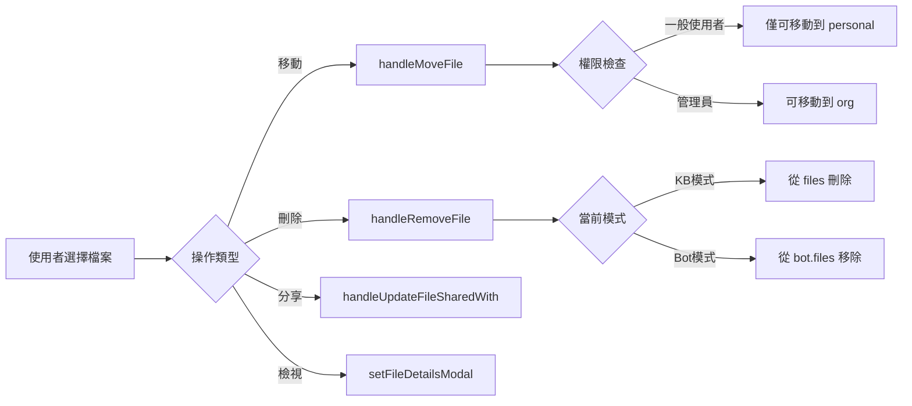
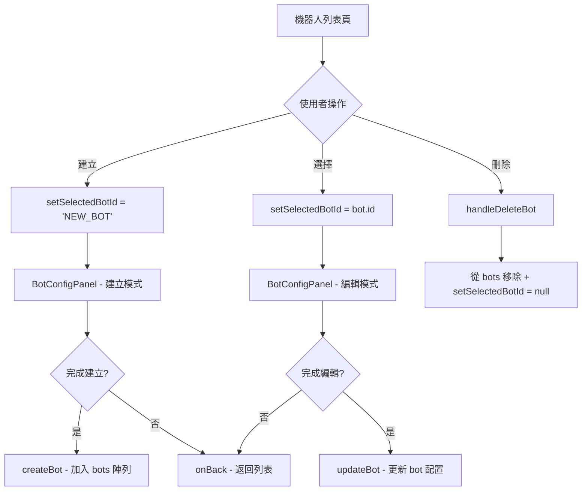
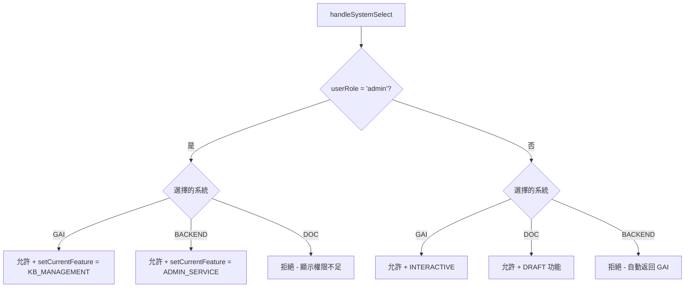

# N946 前端展示專案 - 完整技術文件

## 📌 專案概述

**N946 Frontend Demo** 是一個功能完整的 GAI（Generative AI）應用平台前端展示專案，整合了多個 AI 互動功能，包含知識庫管理、智能問答、答詢機器人、PPT 生成、提示詞優化、文件翻譯以及完整的管理後台系統。

### 技術棧

| 技術 | 版本 | 用途 |
|------|------|------|
| **React** | 18.2.0 | 前端框架 |
| **Vite** | 5.0.8 | 建置工具與開發伺服器 |
| **TailwindCSS** | 3.4.0 | CSS 框架 |
| **Lucide React** | 0.300.0 | 圖標庫 |
| **clsx** / **tailwind-merge** | - | 樣式合併工具 |

### 部署資訊

- **Repository**: `tv6747/n946_frontend_demo`
- **Homepage**: [https://tv6747.github.io/n946_frontend_demo/](https://tv6747.github.io/n946_frontend_demo/)
- **部署方式**: GitHub Pages (`npm run deploy`)

---

## 🏗️ 專案架構

```
frontend_demo/
├── src/
│   ├── App.jsx                    # 主應用程式 (狀態管理與路由邏輯)
│   ├── main.jsx                   # 應用入口
│   ├── index.css                  # 全域樣式
│   ├── assets/                    # 靜態資源
│   │   ├── nlma_logo.jpg          # 系統 Logo
│   │   ├── template1.jpg          # PPT 範本圖片 1
│   │   ├── template2.jpg          # PPT 範本圖片 2
│   │   └── template3.jpg          # PPT 範本圖片 3
│   ├── components/                # 共用元件 (15 個)
│   │   ├── common/                # 通用元件 (6 個)
│   │   │   ├── ChatInput.jsx      # 通用聊天輸入框
│   │   │   ├── ChatMessage.jsx    # 通用聊天訊息 (含 👍/👎/回饋按鈕)
│   │   │   ├── MainDropdown.jsx   # 主功能選擇下拉選單
│   │   │   ├── MenuItem.jsx       # 選單項目元件
│   │   │   ├── ModalOverlay.jsx   # 彈窗覆蓋層
│   │   │   └── TreeNode.jsx       # 樹狀節點元件
│   │   ├── layout/                # 佈局元件
│   │   │   └── MainLayout.jsx     # 主佈局框架
│   │   └── modals/                # 彈窗元件 (8 個)
│   │       ├── ShareModal.jsx     # 分享彈窗
│   │       ├── UploadModal.jsx    # 上傳彈窗
│   │       ├── ExportModal.jsx    # 匯出彈窗
│   │       ├── SaveArchiveModal.jsx # 儲存歸檔彈窗
│   │       ├── LLMSettingsModal.jsx # LLM 設定彈窗
│   │       ├── FileDetailsModal.jsx # 檔案詳情彈窗
│   │       ├── AddTermModal.jsx   # 新增術語彈窗
│   │       └── AddToListModal.jsx # 加入常用清單彈窗
│   ├── features/                  # 功能模組 (39 個元件)
│   │   ├── admin/                 # 管理後台 (21 個元件)
│   │   │   ├── ServiceManagement.jsx        # 服務管理主框架
│   │   │   ├── AppManagement.jsx            # 應用管理
│   │   │   ├── ApplicationManagementPanel.jsx # 應用管理面板
│   │   │   ├── ApplicationConfigPanel.jsx   # 應用配置面板
│   │   │   ├── AccountManagementPanel.jsx   # 帳號管理面板
│   │   │   ├── AccountEditPanel.jsx         # 帳號編輯面板
│   │   │   ├── AuditManagement.jsx          # 稽核管理
│   │   │   ├── UnifiedBackendSidebar.jsx    # 後台統一側邊欄
│   │   │   ├── AdminSidebar.jsx             # 管理側邊欄
│   │   │   ├── BotManagementPanel.jsx       # 機器人管理面板
│   │   │   ├── ModelManagementPanel.jsx     # 模型管理面板
│   │   │   ├── ModelManagement.jsx          # 模型管理
│   │   │   ├── ModelParametersPanel.jsx     # 模型參數面板
│   │   │   ├── PromptManagementPanel.jsx    # 提示詞管理面板
│   │   │   ├── PromptManagement.jsx         # 提示詞管理
│   │   │   ├── PromptConfigPanel.jsx        # 提示詞配置面板
│   │   │   ├── APIManagementPanel.jsx       # API 管理面板
│   │   │   ├── KBPermissionPanel.jsx        # 知識庫權限面板
│   │   │   ├── LLMManagement.jsx            # LLM 管理
│   │   │   ├── LangFlowPanel.jsx            # LangFlow 面板
│   │   │   └── ToolManagementPanel.jsx      # 工具管理面板
│   │   ├── bot/                   # 機器人配置
│   │   │   └── BotConfigPanel.jsx
│   │   ├── chat/                  # 對話功能 (3 個)
│   │   │   ├── ChatInterface.jsx  # 通用對話介面 (含回饋 Modal)
│   │   │   ├── CommonHistorySidebar.jsx # 歷史對話側邊欄
│   │   │   └── WelcomeScreen.jsx  # 歡迎畫面
│   │   ├── corpus/                # 語料庫管理 (7 個)
│   │   │   ├── CorpusFeature.jsx
│   │   │   ├── CorpusSidebar.jsx
│   │   │   ├── ProperNounPanel.jsx
│   │   │   ├── SynonymPanel.jsx
│   │   │   ├── ImportConflictManager.jsx
│   │   │   ├── SynonymManager.jsx
│   │   │   └── TermDefinitionManager.jsx
│   │   ├── kb/                    # 知識庫管理 (2 個)
│   │   │   ├── KBSidebar.jsx
│   │   │   └── KBManagerPanel.jsx
│   │   ├── ppt/                   # PPT 生成 (2 個)
│   │   │   ├── PPTGenerationInterface.jsx  # PPT 生成介面 (含範本管理與回饋)
│   │   │   └── CanvasPreview.jsx
│   │   ├── prompt/                # 提示詞優化 (2 個)
│   │   │   ├── PromptOptimizerInterface.jsx
│   │   │   └── PromptSaveConfirmModal.jsx
│   │   └── translation/           # 文件翻譯
│   │       └── DocumentTranslationInterface.jsx
│   ├── data/                      # 資料與常數
│   │   ├── constants.js           # 系統常數定義
│   │   ├── mockData.js            # 模擬資料 (知識庫、使用者、機器人)
│   │   ├── mockLLMData.js         # LLM 模擬資料
│   │   ├── mockServiceData.js     # 服務模擬資料
│   │   ├── mockToolData.js        # 工具管理模擬資料
│   │   └── scratches/             # 草稿/暫存資料
│   ├── utils/                     # 工具函數
│   │   └── helpers.js             # 樹狀節點查找工具
│   └── hooks/                     # 自定義 Hooks
│       └── useResizable.js        # 可調整大小面板 Hook
├── index.html                     # HTML 入口
├── package.json                   # 專案配置
├── vite.config.js                 # Vite 配置
├── tailwind.config.js             # Tailwind 配置
├── PROJECT_DOCUMENTATION.md       # 完整技術文件
└── README.md                      # 專案說明
```

---

## 🎯 系統核心架構

### 三大平台系統

應用程式支援三個主要系統的切換，並根據使用者角色顯示不同功能：

#### 1. **GAI 互動平台** (`currentSystem = 'GAI'`)
- **對象**: 一般使用者 + 管理員
- **核心功能**:
  - 互動問答 (`INTERACTIVE`)
  - 知識庫管理 (`KB_MANAGEMENT`)
  - PPT 互動產出 (`PPT_GEN`)
  - 提示詞優化 (`PROMPT_OPT`)
  - 文件翻譯 (`DOC_TRANS`)
  - 語料庫管理 (`CORPUS_MANAGEMENT`)
  - 答詢機器人管理 (`BOT_MANAGEMENT`)
  - 預設答詢機器人：人事差勤機器人 (`BOT_HR`)、資訊安全機器人 (`BOT_SECURITY`)

#### 2. **智慧公文輔助系統** (`currentSystem = 'DOC'`)
- **對象**: 僅一般使用者 (管理員無權存取)
- **專用功能**:
  - 首長信箱 (`DRAFT_MAIL`)
  - 例行函稿 - 山坡地社區監測 (`DRAFT_HILL`)
  - 例行函稿 - 禁建限區 (`DRAFT_AREA`)
  - 例行函稿 - 室內裝修 (`DRAFT_DECOR`)
  - 公文檔案上傳生成案件歷程 (`DRAFT_DOC_GEN`)
  - 通用公文撰寫 (`DOC_ASSIST`)

#### 3. **後台管理系統** (`currentSystem = 'BACKEND'`)
- **對象**: 僅管理員
- **管理功能**:
  - **服務管理** (`ADMIN_SERVICE`):
    - 應用管理 (`apps`) - `ApplicationManagementPanel` + `ApplicationConfigPanel`
    - 知識庫權限 (`kb_permission`) - `KBPermissionPanel`
    - 答詢機器人管理 (`bot_management`) - `BotManagementPanel` + `BotConfigPanel`
  - **語料庫管理**:
    - 專有名詞語料庫 (`ADMIN_PROPER_NOUN`)
    - 近似詞語料庫 (`ADMIN_SYNONYM`)
  - **語言模型管理** (`ADMIN_LLM`):
    - 模型管理 (`models`) - `ModelManagementPanel`
    - 模型參數管理 (`params`) - `ModelParametersPanel`
  - **提示詞管理** (`ADMIN_PROMPTS`) - `PromptManagementPanel` + `PromptConfigPanel`
  - **提示詞優化** (`ADMIN_PROMPT_OPT`) - `PromptOptimizerInterface`
  - **API 管理** (`ADMIN_APIS`) - `APIManagementPanel`
  - **工具管理** (`ADMIN_TOOLS`) - `ToolManagementPanel`
  - **帳號管理** (`ADMIN_ACCOUNT`) - `AccountManagementPanel` + `AccountEditPanel`
  - **稽核管理** (`ADMIN_AUDIT`) - `AuditManagement`
    - 子檢視: `kb_logs`, `chat_records`, `stats`
  - **LangFlow** (`ADMIN_LANGFLOW`) - `LangFlowPanel`

---

## 🔑 核心狀態管理

[`App.jsx`](src/App.jsx) 是整個應用的狀態中心，採用 React Hooks 管理狀態：

### 主要狀態

| 狀態變數 | 類型 | 說明 |
|---------|------|------|
| `currentFeature` | Object | 當前選定的功能 (從 `FEATURES` 中選擇) |
| `currentSystem` | String | 當前系統 (`'GAI'` / `'DOC'` / `'BACKEND'`) |
| `userRole` | String | 使用者角色 (`'admin'` / `'user'`) |
| `selectedFolderId` | String | 當前選定的資料夾 ID |
| `files` | Array | 全部檔案資料 (來自 `MASTER_FILES`) |
| `kbTreeData` | Array | 知識庫樹狀結構資料 |
| `bots` | Array | 答詢機器人列表 |
| `selectedBotId` | String/null | 當前選定的機器人 ID |
| `kbMode` | String | 知識庫模式 (`'qa'` / `'manage'`) |
| `kbSelectedFileIds` | Array | RAG 問答選定的檔案 ID 列表 |
| `isSidebarOpen` | Boolean | 側邊欄開關狀態 |
| `favoriteLists` | Array | 常用清單列表 (含 fileIds、isDefault) |
| `selectedFavListId` | String/null | 當前選定的常用清單 ID |
| `favSelectedFileIds` | Array | 常用清單獨立勾選狀態 (與 kbSelectedFileIds 隔離) |
| `isAddToListModalOpen` | Boolean | 加入常用清單彈窗開關 |
| `qaFromDefaultList` | Boolean | 追蹤 QA 上下文是否來自星號預設清單（控制橫幅顯示清單名稱或一般文字） |

### 管理後台專用狀態

| 狀態變數 | 說明 |
|---------|------|
| `adminAppSystem` | 應用系統篩選 (預設 `'ALL'`) |
| `adminAuditView` | 稽核檢視類型 (`'kb_logs'` / `'chat_records'` / `'stats'`) |
| `serviceSubModule` | 服務管理子模組 (`'apps'` / `'kb_permission'` / `'bot_management'`) |
| `llmSubModule` | LLM 管理子模組 (`'models'` / `'params'`) |
| `selectedCorpusId` | 當前語料庫 ID (`'proper_noun'` / `'synonym'`) |

### Modal 狀態

```javascript
isShareModalOpen         // 分享彈窗
isUploadModalOpen        // 上傳彈窗
isExportModalOpen        // 匯出彈窗
isSaveModalOpen          // 儲存歸檔彈窗
isPromptSaveModalOpen    // 提示詞儲存確認彈窗
isLLMModalOpen           // LLM 設定彈窗
isAddTermModalOpen       // 新增術語彈窗
isAddToListModalOpen     // 加入常用清單彈窗
fileDetailsModal         // 檔案詳情彈窗 (存放檔案物件或 null)
isFeedbackModalOpen      // 回饋彈窗 (ChatInterface / PPTGenerationInterface 內部管理)
```

---

## 📊 資料常數定義

所有系統常數定義於 [`constants.js`](src/data/constants.js)：

### 1. 模式定義 (`MODES`)

```javascript
export const MODES = {
  CHAT: 'chat',                              // 一般對話
  KB: 'knowledge',                            // 知識庫
  PROMPT: 'prompt_opt',                       // 提示詞優化
  TRANS: 'translation',                       // 翻譯
  PPT: 'ppt_generation',                      // PPT 生成
  BOT_MGR: 'bot_management',                  // 機器人管理
  CORPUS_MGR: 'corpus_management',            // 語料庫管理
  ADMIN_SERVICE: 'admin_service_management',  // 服務管理
  ADMIN_PROPER_NOUN: 'admin_proper_noun',     // 專有名詞管理
  ADMIN_SYNONYM: 'admin_synonym',             // 近似詞管理
  ADMIN_MODELS: 'admin_models',               // 模型管理
  ADMIN_PARAMS: 'admin_params',               // 參數管理
  ADMIN_PROMPTS: 'admin_prompts',             // 提示詞管理
  ADMIN_APIS: 'admin_apis',                   // API 管理
  ADMIN_LLM: 'admin_llm_management',          // LLM 管理
  ADMIN_TOOLS: 'admin_tool_management',       // 工具管理
  ADMIN_AUDIT: 'admin_audit_management',      // 稽核管理
  ADMIN_LANGFLOW: 'admin_langflow',           // LangFlow
  ADMIN_ACCOUNT: 'admin_account_management',  // 帳號管理
};
```

### 2. 功能特性 (`FEATURES`)

每個 Feature 包含:
- `id`: 唯一識別碼
- `label`: 顯示名稱
- `mode`: 對應的 MODES
- `placeholder`: 輸入框提示文字
- 可選: `allowUpload`, `hideLLMSettings`, `showInstructions`

完整功能列表:

| 分類 | Feature Key | ID | 說明 |
|------|-------------|-----|------|
| **GAI 平台** | `INTERACTIVE` | `interactive` | 互動問答 |
| | `KB_MANAGEMENT` | `kb_manage` | 知識庫管理 |
| | `CORPUS_MANAGEMENT` | `corpus_manage` | 語料庫管理 |
| | `DOC_TRANS` | `doc_trans` | 文件翻譯 |
| | `PPT_GEN` | `ppt_gen` | PPT 互動產出 |
| | `PROMPT_OPT` | `prompt_opt` | 提示詞優化 |
| | `BOT_MANAGEMENT` | `bot_manage` | 答詢機器人管理 |
| | `BOT_HR` | `bot_hr` | 人事差勤機器人 |
| | `BOT_SECURITY` | `bot_security` | 資訊安全機器人 |
| **公文系統** | `DRAFT_MAIL` | `draft_mail` | 首長信箱 |
| | `DRAFT_HILL` | `draft_hill` | 山坡地社區監測 |
| | `DRAFT_AREA` | `draft_area` | 禁建限區 |
| | `DRAFT_DECOR` | `draft_decor` | 室內裝修 |
| | `DRAFT_DOC_GEN` | `draft_doc_gen` | 公文上傳生成歷程 |
| | `DOC_ASSIST` | `doc_assist` | 通用公文撰寫 |
| **後台管理** | `ADMIN_SERVICE` | `admin_service` | 服務管理 |
| | `ADMIN_PROPER_NOUN` | `admin_proper_noun` | 專有名詞語料庫 |
| | `ADMIN_SYNONYM` | `admin_synonym` | 近似詞語料庫 |
| | `ADMIN_MODELS` | `admin_models` | 模型管理 |
| | `ADMIN_PARAMS` | `admin_params` | 模型參數管理 |
| | `ADMIN_PROMPTS` | `admin_prompts` | 提示詞管理 |
| | `ADMIN_APIS` | `admin_apis` | API 管理 |
| | `ADMIN_PROMPT_OPT` | `admin_prompt_opt` | 提示詞優化 (後台) |
| | `ADMIN_LLM` | `admin_llm` | 語言模型管理 |
| | `ADMIN_TOOLS` | `admin_tools` | 工具管理 |
| | `ADMIN_AUDIT` | `admin_audit` | 稽核管理 |
| | `ADMIN_LANGFLOW` | `admin_langflow` | LangFlow |
| | `ADMIN_ACCOUNT` | `admin_account` | 帳號管理 |

### 3. LLM 配置

- **語言列表** (`LANGUAGES`): 自動偵測、正體中文、簡體中文、日語、韓語、英語、法語、德語、西班牙語
- **系統提示預設** (`SYSTEM_PROMPTS`): 通用助手、親切客服、專業嚴謹、創意發想、程式專家
- **模型列表** (`LLM_MODELS`): GPT-4o, Claude 3.5 Sonnet, Gemini 1.5 Pro, Llama 3 70B
- **提示詞範本** (`PROMPT_TEMPLATES`): 通用預設、台灣公文正式語氣、重點摘要專家、創意文案寫手、資深程式架構師

### 4. 歡迎訊息配置 (`WELCOME_CONFIG`)

各功能的歡迎畫面文案與建議問題，例如：

```javascript
kb_qa: { 
  title: '知識庫智能問答',
  sub: '我將基於您選定的文件內容進行回答，請盡量具體提問。',
  suggestions: [
    '總結選定文件的重點', 
    '文件中提到的主要數據有哪些？', 
    '比較這幾份文件的異同之處'
  ]
}
```

### 5. PPT 範本管理

PPT 互動產出功能使用本地範本圖片系統：

```javascript
const LOCAL_PPT_TEMPLATES = [
  { id: 1, name: '範本一', image: tpl1 },  // 系統預設 (不可編輯)
  { id: 2, name: '範本二', image: tpl2 },  // 系統預設 (不可編輯)
  { id: 3, name: '範本三', image: tpl3 },  // 可編輯
];
```

**範本管理功能**:
- ⭐ **多範本收藏**: 可將多個範本標記為常用，常用範本會排列在最前面
- ✏️ **範本編輯**: 非系統範本可重新命名與刪除
- 🚫 **系統範本保護**: 範本一、範本二為系統預設，顯示禁止圖示且不可編輯
- 📤 **上傳新範本**: 支援上傳自定義圖片作為新範本
- 📥 **範本下載**: 可下載範本圖片

---

## 🛠️ 核心功能模組解析

### 1. 知識庫管理 (`KB_MANAGEMENT`)

**雙模式設計**：

#### 模式 A: QA 問答模式 (`kbMode = 'qa'`)
- **UI**: 顯示 `ChatInterface`
- **側邊欄**: 顯示 `CommonHistorySidebar` (歷史對話紀錄)
- **RAG 上下文**: 透過 `kbSelectedFileIds` 選定的檔案作為 RAG 上下文
- **互動**: 使用者可基於選定文件進行智能問答

**預設問答上下文 (Default QA Context)**：

| 進入方式 | 行為 | 橫幅顯示 |
|---------|------|----------|
| 首次進入 KB (無手動選檔) | 自動帶入星號預設清單文件 | `目前使用文件範圍：[清單名稱] • X 個檔案` |
| 點擊 QA 切換按鈕 (無手動選檔) | 自動帶入星號預設清單文件 | 同上 |
| 點擊 QA 切換按鈕 (已勾選文件) | 保留手動勾選 | `基於勾選的 X 個檔案 進行回答` |
| 文件導覽「問答」按鈕 | 使用手動勾選的文件 | `基於勾選的 X 個檔案 進行回答` |
| 無星號清單 | 不自動帶入 | `基於勾選的 X 個檔案 進行回答` |

透過 `qaFromDefaultList` 旗標區分來源，確保手動選檔時不會誤顯示清單名稱。`ChatInterface` 接收 `ragContextLabel` prop 控制橫幅文案。

#### 模式 B: 管理模式 (`kbMode = 'manage'`)
- **UI**: 顯示 `KBManagerPanel`
- **側邊欄**: 顯示 `KBSidebar` (資料夾樹狀結構、常用清單與檔案選擇)
- **功能**:
  - 檔案上傳 (`onUpload`)
  - 檔案移動 (`onMoveFile`)
  - 檔案刪除 (`onRemove`)
  - 檔案分享 (`onShare`)
  - 檢視檔案詳情 (`onViewDetails`)
  - 開始 QA 模式 (`onStartChat`)
  - **常用清單操作** (見下方說明)

#### 常用清單功能 (Favorite Lists)

**側邊欄** (`KBSidebar`) 新增「常用清單」區塊，位於「文件導覽」上方：

| 功能 | 說明 |
|------|------|
| **清單選取** | 點擊清單名稱切換至該清單的文件檢視 |
| **星號預設 (Radio)** | 點擊星號圖示設為預設清單（單選邏輯，僅一個清單可為預設） |
| **Q&A 問答按鈕** | 常駐藍色高亮，點擊以清單內文件為上下文進入 QA 模式 |
| **新增/刪除清單** | 常用清單模式下，左上方按鈕改為清單操作 (`ListPlus` / `ListX` 圖示) |
| **回收桶/上傳 disabled** | 常用清單模式下，回收桶與上傳按鈕自動禁用 |

**管理面板** (`KBManagerPanel`) 的模式差異：

| 項目 | 文件導覽模式 | 常用清單模式 |
|------|-------------|-------------|
| **標題** | 資料夾路徑 | 可編輯清單名稱 (鉛筆按鈕常駐) |
| **工具列** | 常駐顯示 (分享/下載/刪除/問答/加入清單) | 常駐顯示 (下載 + 從清單移除) |
| **勾選狀態** | `kbSelectedFileIds` | `favSelectedFileIds` (獨立隔離) |
| **加入清單** | 勾選文件後點擊 `ListPlus` → 開啟 `AddToListModal` | N/A |
| **從清單移除** | N/A | 勾選文件後點擊 `MinusCircle`（不影響原始文件） |
| **資料夾名稱編輯** | 個人知識庫資料夾顯示鉛筆按鈕，支援 Inline editing | N/A |

**業務邏輯重點**：
- 常用清單僅儲存文件 ID，「從清單移除」不會刪除原始文件
- 常用清單與文件導覽的勾選狀態完全獨立互不影響
- 星號預設清單在進入 QA 時自動載入（僅在無手動選檔的情況下）

**權限控制**:
- 一般使用者可存取 `personal` 和 `shared_*` 資料夾
- 管理員僅能存取 `org` 組織資料夾
- 移動檔案時，一般使用者僅能移動到個人資料夾

---

### 2. 答詢機器人管理 (`BOT_MANAGEMENT`)

**雙視圖設計**：

#### 視圖 A: 機器人列表 (`selectedBotId = null`)
- **元件**: `BotManagementPanel`
- **UI 設計**: 採用標準化卡片介面
  - **狀態顯示**: 左側狀態顏色條 (藍色啟用/灰色停用)
  - **操作區**: 右上角整合「啟用/停用」Switch、「編輯」、「刪除」按鈕
  - **資訊預覽**: 預設模型設定 (參數/提示詞)、關聯文件標籤雲、歡迎詞摘要
- **功能**:
  - 顯示所有機器人列表
  - 建立新機器人 (`onCreate` → `selectedBotId = 'NEW_BOT'`)
  - 選擇機器人進行編輯 (`onSelectBot`)
  - 刪除機器人 (`onDeleteBot`)
  - 更新機器人狀態 (`onUpdateBot`)

#### 視圖 B: 機器人配置 (`selectedBotId !== null`)
- **元件**: `BotConfigPanel`
- **配置項目**:
  - 機器人基本資訊 (名稱、描述)
  - 預設設定 (模型、參數、提示詞)
  - 歡迎訊息與預設問題
  - 關聯檔案 (`files`) - **自動過濾僅顯示組織/單位資料夾**
  - 可存取使用者 (`accessibleUsers`)

#### 預設答詢機器人
- **人事差勤機器人** (`BOT_HR`): 使用 `ChatInterface`，提供假勤相關諮詢
- **資訊安全機器人** (`BOT_SECURITY`): 使用 `ChatInterface`，提供資安相關諮詢

---

### 3. 對話互動 (`ChatInterface`)

**通用對話元件**，用於多種功能：
- 互動問答 (`INTERACTIVE`)
- 知識庫 QA 模式 (`kb_qa`)
- 答詢機器人對話 (`BOT_HR`, `BOT_SECURITY`)
- 公文擬稿 (所有 `DRAFT_*` 功能)
- 通用公文撰寫 (`DOC_ASSIST`)

**特性**:
- 支援 RAG 上下文 (`ragContext`)
- 可匯出對話 (`onExport`)
- 可儲存對話 (`onSave`)
- LLM 設定 (`onOpenLLMSettings`)
- 側邊欄顯示歷史對話 (`CommonHistorySidebar`)

**回饋系統**:
- 每個 AI 回應下方顯示 👍 (讚好)、👎 (不佳)、💬 (回饋) 按鈕
- 點擊「回饋」按鈕會彈出回饋 Modal，讓使用者輸入詳細建議
- 回饋 Modal 在所有對話模式中均可使用（草稿模式及非草稿模式）

---

### 4. PPT 互動產出 (`PPT_GEN`)

**元件**: `PPTGenerationInterface` + `CanvasPreview`

**三欄佈局**:
- **左欄 (可調整)**: 聊天對話區 (使用 `ChatMessage` 元件，含回饋按鈕)
- **中欄 (可調整)**: 畫布預覽區 (`CanvasPreview`)
- **右側面板 (可收合)**: 範本選擇面板

**範本管理功能**:
- ⭐ **收藏系統**: 可標記多個範本為「常用」(黃色星號)，常用範本置頂顯示
- ✏️ **內嵌編輯**: 非系統範本可直接在卡片底部重新命名
- 🗑️ **刪除**: 編輯模式下可刪除非系統範本
- 🚫 **系統保護**: 範本一/二 (ID 1, 2) 為預設範本，hover 時顯示 `Ban` 圖示與「預設範本不可編輯」提示
- 📤 **上傳**: 底部虛線框上傳按鈕，支援圖片格式
- 📥 **下載**: hover 時顯示下載按鈕

**回饋 Modal**:
- PPT 互動產出也提供完整的回饋功能 (👍/👎/回饋)
- 點擊回饋按鈕彈出 Modal

---

### 5. 語料庫管理 (`CORPUS_MANAGEMENT`)

**管理工具**:
- `ProperNounPanel`: 專有名詞與定義管理
- `SynonymPanel`: 近似詞與標準詞對應管理
- `CorpusFeature`: 語料庫主框架
- `ImportConflictManager`: 匯入衝突處理
- `SynonymManager`: 同義詞管理
- `TermDefinitionManager`: 術語定義管理

**切換邏輯**:
```javascript
selectedCorpusId: 'proper_noun' | 'synonym'
```

---

### 6. 管理後台 (`BACKEND` System)

**服務管理** (`ADMIN_SERVICE`):
- 應用管理 (`apps`): `ApplicationManagementPanel` + `ApplicationConfigPanel`
- 知識庫權限 (`kb_permission`): `KBPermissionPanel`
- 答詢機器人管理 (`bot_management`): `BotManagementPanel` + `BotConfigPanel`

**語言模型管理** (`ADMIN_LLM`):
- 模型管理 (`models`): `ModelManagementPanel`
- 模型參數管理 (`params`): `ModelParametersPanel`

**提示詞管理** (`ADMIN_PROMPTS`):
- `PromptManagementPanel` + `PromptConfigPanel`

**其他管理模組**:
- 專有名詞語料庫 (`ADMIN_PROPER_NOUN`): `ProperNounPanel`
- 近似詞語料庫 (`ADMIN_SYNONYM`): `SynonymPanel`
- 提示詞優化 (`ADMIN_PROMPT_OPT`): `PromptOptimizerInterface`
- API 管理 (`ADMIN_APIS`): `APIManagementPanel`
- 工具管理 (`ADMIN_TOOLS`): `ToolManagementPanel`
- 帳號管理 (`ADMIN_ACCOUNT`): `AccountManagementPanel` + `AccountEditPanel`
- 稽核管理 (`ADMIN_AUDIT`): `AuditManagement`
  - 子檢視: `kb_logs`, `chat_records`, `stats`
- LangFlow (`ADMIN_LANGFLOW`): `LangFlowPanel`

**側邊欄**: `UnifiedBackendSidebar` (整合所有管理功能的導航)

---

### 7. 其他功能模組

- **提示詞優化** (`PROMPT_OPT`): `PromptOptimizerInterface` + `PromptSaveConfirmModal`
- **文件翻譯** (`DOC_TRANS`): `DocumentTranslationInterface`

---

## 🔄 核心資料流與操作邏輯

### 檔案操作流程



### 機器人管理流程



### 系統切換與權限控制



---

## 💬 回饋系統

### 架構

所有 AI 回應訊息均支援回饋功能，由以下元件組成:

#### `ChatMessage` 元件 (`components/common/ChatMessage.jsx`)
- 每個 AI 回應訊息下方顯示:
  - 👍 (ThumbsUp) 按鈕
  - 👎 (ThumbsDown) 按鈕
  - 💬 回饋 (MessageCircle) 按鈕 → 觸發回饋 Modal

#### 回饋 Modal
- **觸發方式**: 點擊 AI 回應下方的「回饋」按鈕
- **UI**: 全螢幕覆蓋 Modal (背景半透明黑) + 白色圓角卡片
- **內容**: 標題「提供回饋」+ 說明文字 + 文字輸入區 + 取消/送出按鈕
- **動畫**: `fade-in` + `zoom-in-95`

#### 支援的功能頁面
| 功能 | 回饋按鈕 | 回饋 Modal |
|------|---------|-----------|
| 互動問答 | ✅ | ✅ |
| 知識庫問答 | ✅ | ✅ |
| 人事差勤機器人 | ✅ | ✅ |
| 資訊安全機器人 | ✅ | ✅ |
| PPT 互動產出 | ✅ | ✅ |
| 智慧公文輔助系統 (所有草稿) | ✅ | ✅ |
| 通用公文撰寫 | ✅ | ✅ |

---

## 🧩 工具函數

定義於 [`helpers.js`](src/utils/helpers.js)：

### `findNodeById(nodes, id)`
遞迴搜尋樹狀結構中的節點。

### `findNodePath(nodes, targetId, currentPath = [])`
取得節點的完整路徑（標籤陣列）。

### `getAllFileIds(node, allFiles)`
遞迴取得節點及其所有子節點中的檔案 ID。

---

## 🪝 自定義 Hooks

### `useResizable(initialPercentage)`

定義於 [`useResizable.js`](src/hooks/useResizable.js)：

提供可調整大小的面板功能，返回:
- `leftWidth`: 左側面板寬度百分比
- `startResizing`: 開始調整大小的事件處理器

**使用場景**: `ChatInterface` (草稿模式)、`PPTGenerationInterface`

---

## 🎨 UI 佈局結構

### 主佈局元件 (`MainLayout`)

```jsx
<MainLayout 
  sidebar={renderSidebar()} 
  header={renderHeader()} 
  modals={...}
>
  {/* 主內容區 - 根據 currentFeature.mode 動態渲染 */}
</MainLayout>
```

### 側邊欄渲染邏輯

```javascript
{currentSystem === 'BACKEND' ? (
  <UnifiedBackendSidebar ... />
) : currentFeature.mode === MODES.KB ? (
  kbMode === 'qa' ? (
    <CommonHistorySidebar currentFeatureId="kb_qa" />
  ) : (
    <KBSidebar ... />
  )
) : (
  <CommonHistorySidebar currentFeatureId={currentFeature.id} />
)}
```

### 標題列渲染邏輯

- **GAI/DOC 系統**: 顯示 `MainDropdown` (功能選擇器)
- **BACKEND 系統**: 顯示動態標題與描述 (`getAdminHeaderInfo()`)
- **KB 模式**: 顯示 QA/管理 切換按鈕

---

## 🔐 角色與權限控制

### 角色定義

| 角色 | `userRole` 值 | 可存取系統 | 限制 |
|------|---------------|-----------|------|
| **一般使用者** | `'user'` | GAI, DOC | 無法存取 BACKEND 系統<br/>無法存取 `org` 資料夾 |
| **管理員** | `'admin'` | GAI, BACKEND | 無法存取 DOC 系統<br/>無法存取 `personal` 和 `shared_*` 資料夾 |

---

## 📦 Modal 彈窗系統

### 通用彈窗

| 彈窗元件 | 觸發時機 | 用途 |
|---------|---------|------|
| `ShareModal` | 點擊分享按鈕 | 設定檔案分享對象 |
| `UploadModal` | 點擊上傳按鈕 | 上傳新檔案到知識庫 |
| `ExportModal` | 匯出對話紀錄 | 選擇匯出格式 (PDF/Word/Markdown) |
| `SaveArchiveModal` | 儲存對話 | 命名並儲存對話歷史 |
| `LLMSettingsModal` | LLM 設定按鈕 | 調整模型、溫度、範本等參數 |
| `FileDetailsModal` | 點擊檔案詳情 | 顯示檔案元資料與分享狀態 |
| `AddTermModal` | 新增術語 | 在語料庫中新增專有名詞或同義詞 |
| `AddToListModal` | 加入常用清單按鈕 | 將已選文件加入現有或新增的常用清單 |
| `PromptSaveConfirmModal` | 儲存系統提示詞 | 確認儲存優化後的提示詞 |
| **回饋 Modal** | 點擊回饋按鈕 | AI 回應評價與回饋 (內嵌於 ChatInterface / PPTGenerationInterface) |

---

## 🌐 路由與功能切換邏輯

### 主路由判斷

應用程式採用 **條件渲染** 而非傳統路由：

```javascript
{currentFeature.mode === MODES.KB && (
  kbMode === 'manage' ? <KBManagerPanel ... /> : <ChatInterface ... />
)}

{currentFeature.mode === MODES.CHAT && <ChatInterface ... />}
{currentFeature.mode === MODES.PPT && <PPTGenerationInterface ... />}
{currentFeature.mode === MODES.PROMPT && <PromptOptimizerInterface ... />}
{currentFeature.mode === MODES.TRANS && <DocumentTranslationInterface />}
{currentFeature.mode === MODES.CORPUS_MGR && <CorpusFeature ... />}

{currentFeature.mode === MODES.ADMIN_SERVICE && (
  serviceSubModule === 'bot_management' ? (
    selectedBotId ? <BotConfigPanel ... /> : <BotManagementPanel ... />
  ) : <ServiceManagement ... />
)}

{currentFeature.mode === MODES.ADMIN_PROPER_NOUN && <ProperNounPanel />}
{currentFeature.mode === MODES.ADMIN_SYNONYM && <SynonymPanel />}
{currentFeature.mode === MODES.ADMIN_LLM && (
  llmSubModule === 'models' ? <ModelManagementPanel /> : <ModelParametersPanel />
)}
{currentFeature.mode === MODES.ADMIN_PROMPTS && <PromptManagementPanel />}
{currentFeature.mode === MODES.ADMIN_APIS && <APIManagementPanel />}
{currentFeature.mode === MODES.ADMIN_TOOLS && <ToolManagementPanel />}
{currentFeature.mode === MODES.ADMIN_AUDIT && <AuditManagement ... />}
{currentFeature.mode === MODES.ADMIN_LANGFLOW && <LangFlowPanel />}
{currentFeature.mode === MODES.ADMIN_ACCOUNT && <AccountManagementPanel />}
```

---

## 📊 模擬資料

| 資料檔案 | 說明 |
|---------|------|
| `mockData.js` | 知識庫樹狀結構、檔案列表、使用者清單、機器人資料 |
| `mockLLMData.js` | LLM 模型清單、模型參數配置 |
| `mockServiceData.js` | 服務管理模擬資料、應用列表 |
| `mockToolData.js` | 工具管理模擬資料 |

---

## 🧪 開發與部署

### 本地開發

```bash
# 安裝依賴
npm install

# 啟動開發伺服器
npm run dev
# 預設會在 http://localhost:5173 啟動
```

### 建置與部署

```bash
# 建置生產版本
npm run build

# 預覽建置結果
npm run preview

# 部署到 GitHub Pages
npm run deploy
```

---

## 🔍 關鍵設計模式與最佳實踐

### 1. **狀態提升 (Lifted State)**
- 所有重要狀態集中在 `App.jsx`
- 子元件透過 props 接收狀態與更新函數
- 確保資料流清晰可追蹤

### 2. **條件渲染替代路由**
- 使用 `currentFeature.mode` 判斷顯示的元件
- 減少外部依賴，降低專案複雜度
- 適合 Demo 專案的快速迭代

### 3. **useMemo 優化計算**
- `displayFiles`: 根據模式與選擇動態過濾檔案
- `filesInCheckedFolders`: 聚合多個資料夾的檔案
- `systemFeatures`: 根據角色與系統過濾可見功能
- 避免不必要的重新計算

### 4. **useEffect 自動調整**
- 角色切換時自動調整系統、功能、資料夾
- 機器人選擇時自動同步關聯檔案
- 保持 UI 狀態一致性

### 5. **元件組合 (Composition)**
- `MainLayout` 接收 `sidebar`, `header`, `modals` 作為 props
- `ChatMessage` 統一所有對話功能的訊息格式與回饋按鈕
- 提高元件重用性與靈活性

### 6. **模擬資料分離**
- 所有假資料集中在 `data/` 資料夾
- 便於未來替換為真實 API

---

## 📝 後續擴充建議

1. **路由系統**: 引入 `react-router-dom` 實現 URL 導航
2. **狀態管理**: 使用 Redux/Zustand 管理複雜狀態
3. **API 整合**: 替換 mock data 為真實後端 API
4. **測試**: 加入 Jest + React Testing Library
5. **國際化**: 使用 `react-i18next` 支援多語系
6. **效能優化**: 使用 React.lazy 與 Suspense 進行程式碼分割
7. **表單驗證**: 引入 `react-hook-form` + `zod`
8. **文件系統**: 加強檔案拖放、批次操作、進度顯示
9. **權限系統**: 實作細粒度的 RBAC (角色基礎存取控制)
10. **日誌與監控**: 加入前端錯誤追蹤 (Sentry)

---

## 📚 核心檔案導覽

| 檔案路徑 | 說明 |
|---------|------|
| `src/App.jsx` | 主應用程式，包含所有狀態管理與路由邏輯 |
| `src/data/constants.js` | 系統常數、模式、功能、LLM 配置定義 |
| `src/utils/helpers.js` | 樹狀結構搜尋與路徑工具函數 |
| `src/hooks/useResizable.js` | 可調整大小面板 Hook |
| `src/components/common/ChatMessage.jsx` | 通用訊息元件 (含回饋按鈕) |
| `src/components/common/ChatInput.jsx` | 通用聊天輸入元件 |
| `src/features/chat/ChatInterface.jsx` | 通用對話介面 (含回饋 Modal) |
| `src/features/ppt/PPTGenerationInterface.jsx` | PPT 生成介面 (含範本管理) |
| `package.json` | 專案依賴與腳本配置 |

---

## 🎯 總結

**N946 Frontend Demo** 是一個架構完整的企業級 AI 應用平台 Demo，展示了:

✅ **多系統整合**: GAI 互動、公文輔助、後台管理三大系統  
✅ **權限控制**: 管理員與一般使用者的差異化功能  
✅ **模組化設計**: 清晰的功能分離與元件組合 (40+ 個功能元件)  
✅ **狀態管理**: 集中式狀態管理，資料流清晰  
✅ **使用者體驗**: 友善的 UI/UX 與豐富的互動功能  
✅ **回饋系統**: 統一的 AI 回應回饋機制 (👍/👎/回饋 Modal)  
✅ **範本管理**: PPT 範本的收藏、編輯、上傳、系統保護機制  
✅ **常用清單**: 知識庫文件收藏清單，支援 Q&A 快速問答與獨立勾選  
✅ **完整後台**: 21 個管理元件涵蓋服務、模型、帳號、稽核等管理功能  

此專案可作為 AI SaaS 平台前端的參考架構，適合快速原型開發與功能展示。
